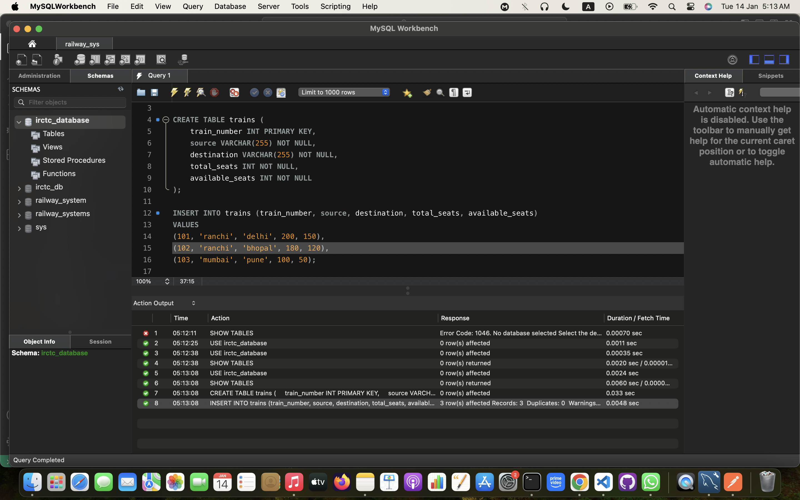
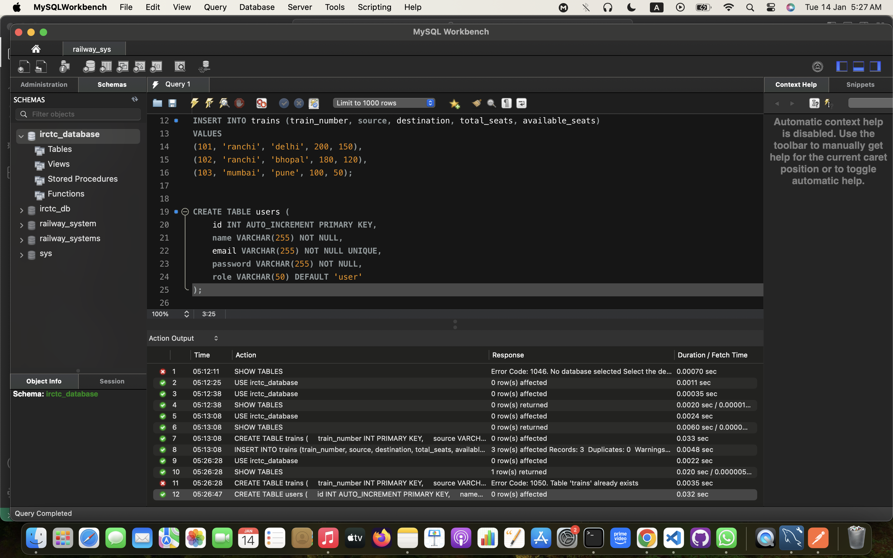
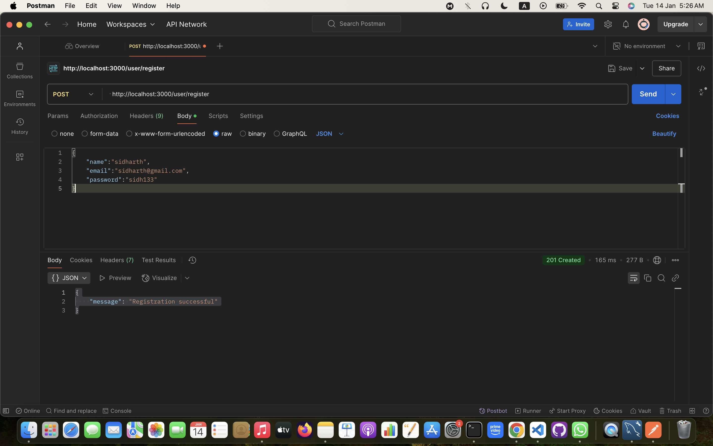
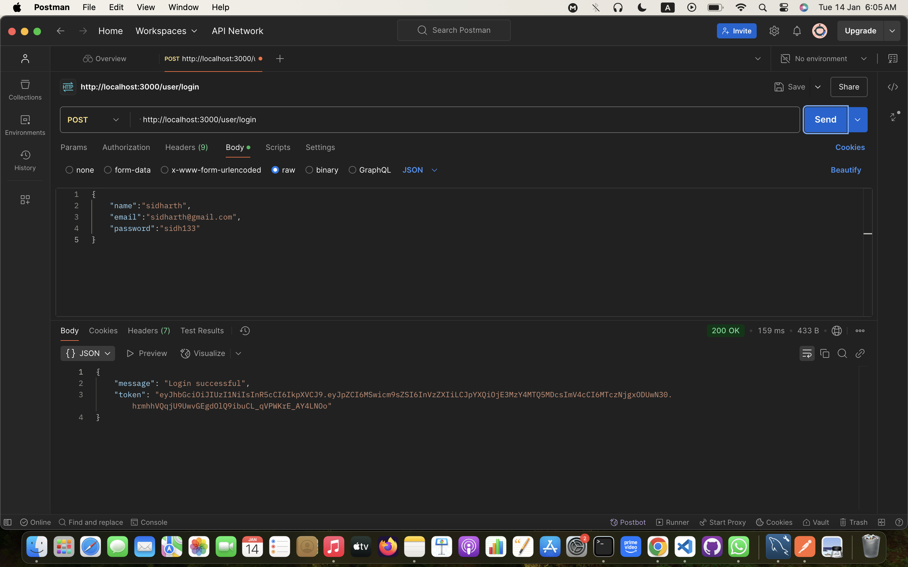
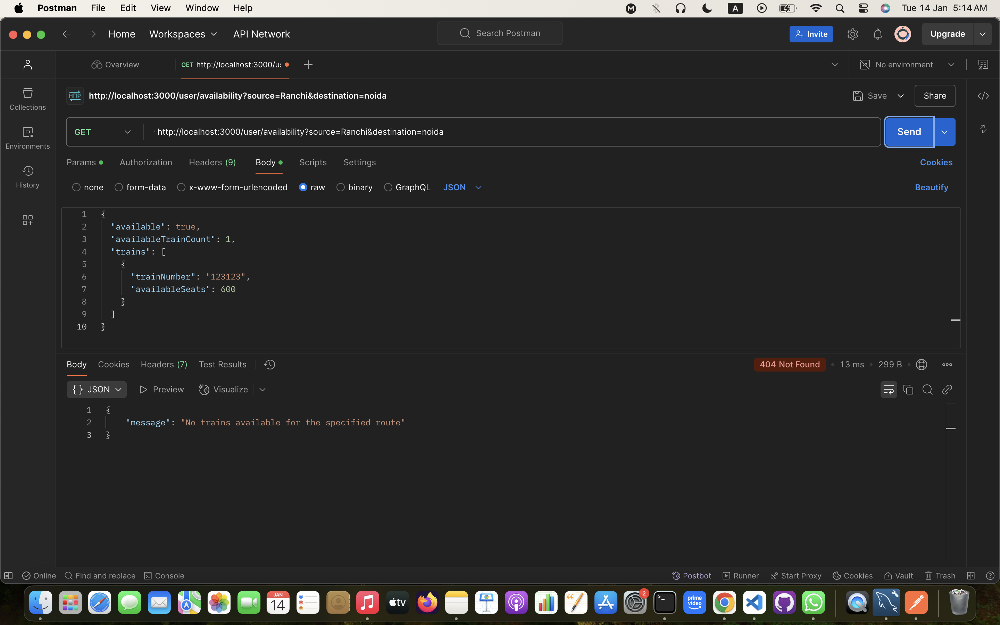
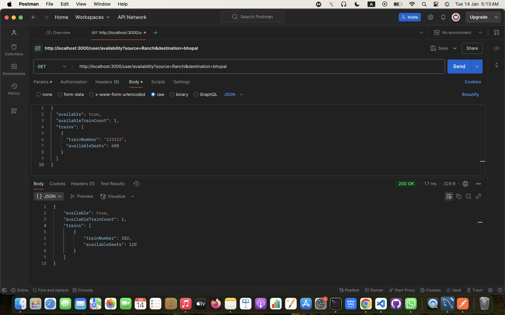

# Railway Management System

A RESTful API for a **Railway Management System** like IRCTC, built with Express.js and MYSQL.

## Features

- User registration and authentication
- Admin-only operations for managing trains
- Real-time seat availability checking
- Secure seat booking with race condition handling
- Booking details retrieval

## Prerequisites

- Node.js (v14 or higher)
- MySQL (8.0.40)
- Postman

## Setup

1. Clone the repository:
   ```bash
   git clone <repository-url>
   cd railway-management-system
   ```

2. Install dependencies:
   ```bash
   npm install bcryptjs cors dotenv express jsonwebtoken mysql2
   npm install --save-dev jest nodemon
   npm install
   ```

3. Create a `.env` file based on `.env.example` and fill in your configuration:
   ```
   PORT=3000
    DB_USER=root
    DB_HOST=localhost
    DB_NAME=irctc_database
    DB_PASSWORD=onedirection
    DB_PORT=3306
    JWT_SECRET=Work_India

   ```

4. Set up the database:
   - Create a new MYSQL database as irctc_database
   - Run the migration script from `database/schema.sql`
   ```bash
    
    CREATE DATABASE irctc_database;
    USE irctc_database;
    SHOW TABLES;

    CREATE TABLE trains (
    train_number INT PRIMARY KEY,
    source VARCHAR(255) NOT NULL,
    destination VARCHAR(255) NOT NULL,
    total_seats INT NOT NULL,
    available_seats INT NOT NULL
    );

    INSERT INTO trains (train_number, source, destination, total_seats, available_seats)
    VALUES
    (101, 'ranchi', 'delhi', 200, 150),
    (102, 'ranchi', 'bhopal', 180, 120),
    (103, 'mumbai', 'pune', 100, 50);

```
5. Start the server:
   ```bash
   npm run dev
   ```

## API Endpoints

### Authentication
    1. Register a new user
       * HTTP Method :- POST
       * Endpoint :- http://localhost:3000/user/register
       * Body:
```bash
- POST `/api/auth/register` - Register a new user
{
  "name": "sidharth",
  "email": "sidharth@gmail.com",
  "password": "sidharth1234"
}
```
    2. Login
   - HTTP Method :- POST
   - Endpoint :- http://localhost:3000/user/login
   - Body:
```bash
- POST `/api/auth/login` - Login and get JWT token
```
### Trains

- GET `/api/trains/availability` - Get trains between stations
   - HTTP Method :- GET
   - Endpoint :- http://localhost:3000/user/availability?source=Ranchi&destination=Delhi
   - Query Parameters
     - source: Source station (e.g., "Bhopal")
     - destination: Destination station (e.g., "Delhi")
   - Response:

- POST `/api/trains` - Add a new train (Admin only)


### Bookings

- POST `/api/bookings` - Book a seat
    - HTTP Method :- POST
    - Endpoint :- http://localhost:3000/user/book
    - Request Body:

- GET `/api/bookings/:id` - Get booking details

    - HTTP Method :- GET
    - Endpoint :- http://localhost:3000/user/getAllbookings

    - Response:

```bash
[
    {
        "booking_id": 17,
        "number_of_seats": 50,
        "train_number": "123123",
        "source": "Sadalpur",
        "destination": "Delhi"
    }
]
```

## Security

- JWT-based authentication for protected routes
- API key authentication for admin operations
- Row Level Security (RLS) in database
- Password hashing using bcrypt

## Race Condition Handling

The booking system uses PostgreSQL's transaction isolation and row-level locking to prevent race conditions during seat booking:

1. Starts a transaction
2. Locks the train record
3. Checks seat availability
4. Creates booking and updates seat count atomically
5. Commits or rolls back the transaction

## Assumptions

1. Each booking is for one seat only
2. Train routes are direct (no intermediate stations)
3. Admin users are created directly in the database
4. Cancellation feature is not implemented
5. Seat numbers are not assigned (only total count is maintained)


# photos of the project
### Screenshots of the Project
#### 1. Database Creation
Description: Creation of the Table for the IRCTC management system in MYSQL





#### 2. User Registration
Description: Check if the user exist's



---

#### 3. User Lgin
Description: Login the person



---


#### 2. Train Availability





Run tests using:
```bash
npm run start
npm run dev
```# WorkIndia_Assignment_SDE_Intern
